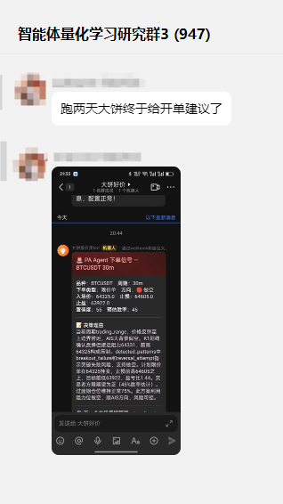
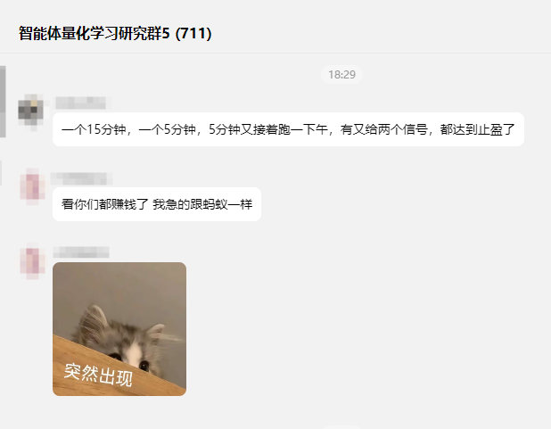
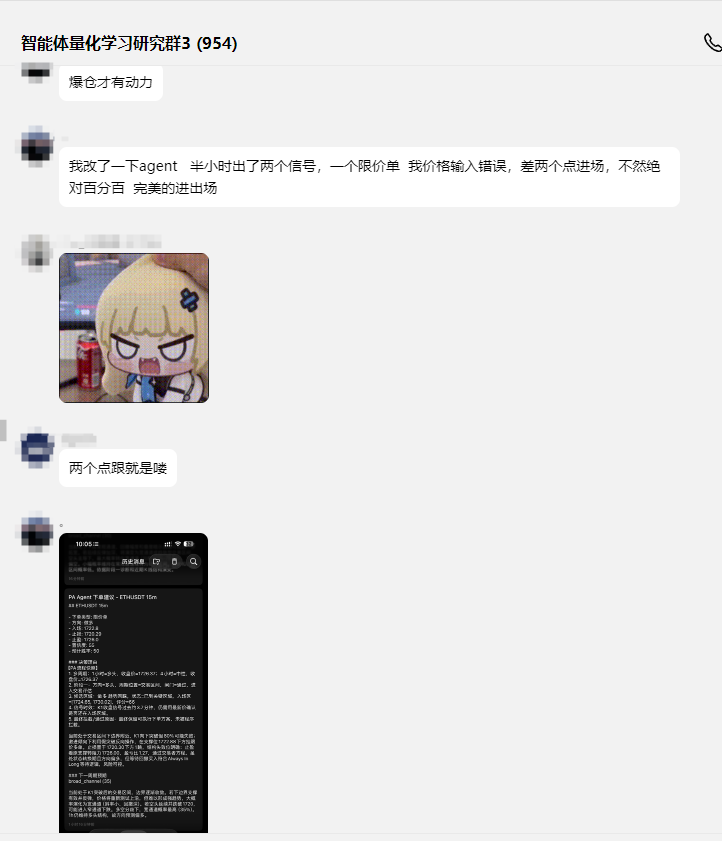
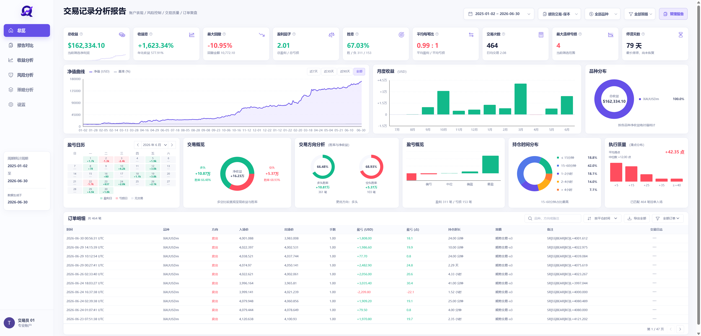
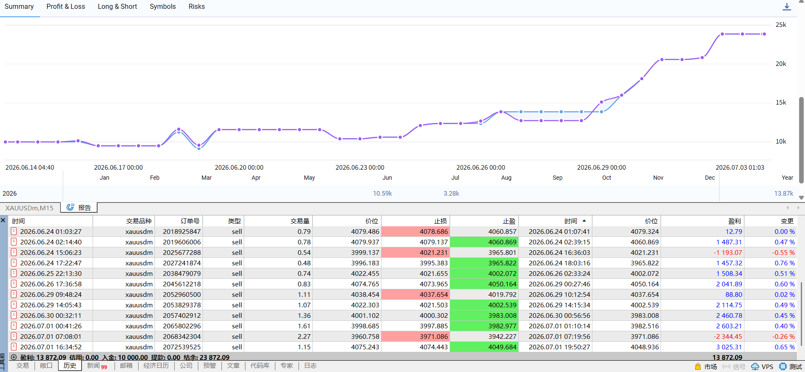

# PA Agent — AI K线分析辅助工具

**交流 QQ 群：1016222782**

---

面向主观交易者的 **价格行为（Price Action）** AI 辅助决策工具。从 **MT5 / TradingView / yfinance / AkShare** 读取 K 线，将结构化 K 线数据与预计算特征送入大模型做**两阶段分析**（市场诊断 → 交易决策），**不是**截图识图，**不连接券商、不执行下单**。

**Web 端（`pa_agent/webui/`，FastAPI + React）现为主要交互入口**，覆盖桌面版全部功能（K线图、AI 两阶段决策分析、决策树回放、动画流程图可视化、自由对话、演示模式回放、飞书/PushPlus 通知触发），并新增桌面版没有的交易记录分析报告页面。原 PyQt6 桌面 GUI（`pa_agent/gui/`）保留在仓库中作为参考/备用实现，可独立运行，但不再投入新功能开发——迁移过程与范围见 [`docs/webui_migration/`](docs/webui_migration/)（含最终验收报告 [`docs/webui_migration/final-acceptance-report.md`](docs/webui_migration/final-acceptance-report.md)）。

---

## 主要功能

- 📈 **多数据源**：MT5（Windows）、TradingView（全平台）、yfinance（期货/加密货币）、AkShare（A 股）
- 🧠 **两阶段 AI 分析**：市场诊断 → 策略路由 → 交易决策（限价/突破/市价或不下单）
- 🔄 **增量分析与持续跟踪**：新增 K 线时复用上次结论；开启 `keep_analysis` 后新 K 线收盘自动触发新一轮分析
- 🌳 **决策树可视化**：赛博科幻风格可交互流程图，自动播放闸门→策略路径动画
- 🔮 **未来走势预期**：AI 预测下一根 K 线方向和下一个市场周期位置
- 💬 **分析后自由追问**：完整对话会话管理器，实时推理流 + Token 进度条，对话历史持久化
- 📚 **经验库**：按周期位置检索历史案例供分析参考
- 📝 **完整落盘**：Prompt、原始响应、诊断/决策 JSON、Token 用量、追问记录
- 🛡️ **可配置校验体系**：JSON 校验、一致性检查、语义校验、截断修复、失败自动重试
- 🔒 **API Key** 本地加密存储

---

## 环境要求

| 项目     | 要求                                                                    |
| -------- | ----------------------------------------------------------------------- |
| 操作系统 | Windows 10 / 11（主支持）、macOS 12+（TradingView 数据源）              |
| Python   | 3.11+                                                                    |
| 数据源   | MT5 / TradingView / yfinance / AkShare **至少配置一种**                  |
| 网络     | 可访问所配置的 AI API（如 DeepSeek、PackyAPI 等）                        |

---

## 快速开始（Web 端，推荐）

```cmd
pip install -e ".[webui]"
cd pa_agent/webui/frontend && npm install && npm run build && cd ../../..
python start_webui.py
```

浏览器打开 `http://127.0.0.1:8765`，在**设置**中填写 **Base URL**、**模型名** 与 **API Key**。

> 前端开发模式（Vite dev server，热重载，代理 `/api`/`/ws` 到 127.0.0.1:8765）：`make dev-webui-frontend`（需另开一个终端先 `make run-webui`）。也可用 `make run-webui` / `make build-webui-frontend` 代替上面两条命令。

## 桌面端（PyQt6，legacy 参考实现）

```cmd
pip install -e .
python -m pa_agent.main
```

首次启动后在**设置**中填写 **Base URL**、**模型名** 与 **API Key**。桌面端功能与 Web 端等价（迁移期间未删减），仍可独立运行，但新功能只在 Web 端实现，详见 `pa_agent/gui/` 目录顶部说明。

> 如需隔离环境也可创建虚拟环境：`python -m venv .venv` 后激活再 `pip install -e .`。

**安装内容**：PyQt6（GUI 框架）+ pyqtgraph（K 线图表绘图）+ numpy/pandas（数据处理）+ openai（AI API 客户端）+ **akshare/baostock（A 股数据源）** + json 校验、模型定义等全套依赖。

> 若需运行测试（pytest）或代码格式化（ruff/black），额外安装：`pip install -e ".[dev]"`。

---

## 详细说明

完整操作界面说明见 [`PA_Agent使用文档.md`](PA_Agent使用文档.md)（以桌面版界面为主线描述，Web 端功能对等，界面细节以实际页面为准），配置字段说明见 [`config/README.md`](config/README.md)。Web 端迁移的设计与阶段记录见 [`docs/webui_migration/`](docs/webui_migration/)。

---

**免责声明**：本工具仅供学习与研究，不构成投资建议。交易有风险，决策后果自负。

本项目采用 [GNU Affero General Public License v3.0 (AGPL-3.0)](LICENSE) 发布。

---

## 群友反馈榜单

感谢群友的使用反馈与鼓励，以下为群友评价截图（按时间从早到晚排列）：

<p align="center">
  
</p>
<p align="center">
  
</p>
<p align="center">
  
</p>
<p align="center">
  
</p>
<p align="center">
  
</p>
<p align="center">
  
</p>
<p align="center">
  
</p>
<p align="center">
  
</p>
<p align="center">
  
</p>
<p align="center">
  
</p>
<p align="center">
  
</p>
<p align="center">
  
</p>
<p align="center">
  
</p>
<p align="center">
  
</p>
<p align="center">
  
</p>
<p align="center">
  
</p>
<p align="center">
  
</p>
<p align="center">
  
</p>
<p align="center">
  
</p>

---

## 打赏与支持

如果你觉得这个程序对你有帮助的话，可以打赏激励作者继续优化程序，感谢你的支持和鼓励！

（作者会优先解决打赏人的问题，因为人太多了！回复不过来！）

<p align="center">
  
</p>
