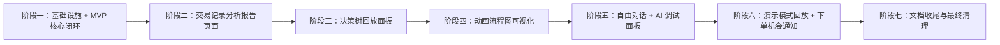

# PA_Agent Web 前端迁移总纲

> 创建日期：2026-07-15
> 状态：**已完成**（阶段一至七全部验收通过，见 [`phase-7-completion-report.md`](phase-7-completion-report.md) 与 [`final-acceptance-report.md`](final-acceptance-report.md)）
> 架构参照：`tradingAgents/webui/`（见 `tradingAgents/docs/dev_guide/terminal.md`）
> 协议参照：`tradingAgents/docs/local/designs/design/strategy_plugin_migration/README.md`
> 设计参照（阶段二专用）：`pa_agent/qunyou/AD48DF6289CB6A9D51FE0B8EE2EC38C2.jpg`（交易记录分析报告仪表盘视觉稿，见 §5 阶段二）

## 1. 改造目标

把 PA_Agent 的交互入口从 PyQt6 桌面应用（`pa_agent/gui/`）迁移到本地 Web 应用（FastAPI + React/TypeScript），最终功能范围全量对齐现有 GUI（K线图、AI 两阶段决策分析、决策树回放、动画流程图可视化、自由对话、演示模式回放、飞书/PushPlus 通知配置与触发、下单机会提醒），并新增一个现有 GUI 尚不具备的**交易记录分析报告**页面（净值曲线、回撤、胜率、盈亏日历、订单明细等，见 §5 阶段二）。

核心业务逻辑（`pa_agent/orchestrator/`、`pa_agent/data/`、`pa_agent/indicators/`、`pa_agent/config/`、`pa_agent/records/`、`pa_agent/notify/`）本身与 Qt 基本无关，本次迁移**只重写表现层**：

- 两个 Qt 耦合的包装类需要 asyncio/Web 等价物：`pa_agent/data/refresh_loop.py::RefreshLoop`（QThread 轮询）、`pa_agent/gui/main_window.py::_AnalysisWorker`（QThread 包装 `TwoStageOrchestrator.submit`）。
- `pa_agent/util/event_bus.py::EventBus`（基于 pyqtSignal）需要 WebSocket/异步队列等价的广播机制。
- 其余核心模块直接被新的 `pa_agent/webui/` 后端调用，不做业务逻辑改动。

`pa_agent/gui/` 保留在仓库中作为参考/备用，迁移期间及之后都不主动删除，但不再投入新功能开发——所有新功能只在 Web 端实现。

## 2. 设计边界

本轮迁移覆盖"交互/展示层"，明确不涉及：

- AI 决策算法本身、Prompt 内容（`pa_agent/ai/prompts/`、`pa_agent/orchestrator/two_stage.py` 的决策树逻辑）；
- `DataSource` 具体实现细节（MT5/TradingView/OKX 等抓取逻辑）；
- `config/settings.json` 的 Pydantic schema 本身（除非因 Web 端暴露需要新增脱敏/加密处理，且必须在触及该部分的具体阶段单独说明并只做最小必要改动，不得借机重构整个配置系统）。

### 2.1 两套视觉主题并存（重要，不是疏漏）

本项目存在两套互相独立、刻意不统一的视觉主题，实施任何阶段前必须先确认自己在做哪一套：

1. **暗色主题**（阶段一、三、四、五、六使用）：源自 `pa_agent/gui/theme/tokens.py`，用于 K线图/AI决策分析/决策树/流程图/自由对话/演示模式等"实时分析工作台"类页面，与桌面 GUI 视觉保持一致。
2. **浅色卡片仪表盘主题**（仅阶段二使用）：源自 `pa_agent/qunyou/AD48DF6289CB6A9D51FE0B8EE2EC38C2.jpg`，用于"交易记录分析报告"这一类事后统计复盘页面，是全新设计、现有 GUI 没有对应实现，白底、圆角卡片、左侧竖排图标导航。

两套主题不合并、不互相渗透：阶段二页面允许出现独立的浅色布局/配色/侧边导航，不必套用阶段一的 `tokens.css`；阶段一及之后的暗色页面也不得因为阶段二而改动配色。若后续阶段发现有必要统一视觉语言，须作为独立议题向用户提出，不得在某个阶段顺手统一。

## 3. 单 Session 单阶段协议

这是后续所有执行 Session（阶段一起）的强制规则。

### 3.1 Session 开始

每个 Session 只允许执行一个阶段。开始时必须依次读取：

1. 本总纲（`README.md`）；
2. 当前阶段执行方案（`phase-N-execution-plan.md`）；
3. 上一阶段总结报告，如果存在（`phase-(N-1)-completion-report.md`）；
4. 与当前阶段直接相关的开发指南和实际代码（包括 `pa_agent/gui/` 中对应模块，作为行为参照；以及 `tradingAgents/webui/` 中的对应实现，作为架构参照；阶段二额外需要查看 `pa_agent/qunyou/AD48DF6289CB6A9D51FE0B8EE2EC38C2.jpg` 设计稿）。

开始实施前必须检查 `git status --short`，识别并保留用户已有修改，不得清理或回滚无关变更。

### 3.2 Session 范围

- 只实现当前阶段执行方案中列出的内容。
- 不实现下一阶段代码，即使当前阶段提前完成。
- 发现下一阶段问题时，记录到当前阶段总结报告和下一阶段执行方案。
- 当前阶段需要的小范围兼容修改可以实施，但必须在总结报告中说明原因。
- 超出阶段边界的高风险变更必须停止并记录，不能用临时补丁悄悄跨阶段。

### 3.3 Session 结束门禁

只有同时满足以下条件，才能把阶段标记为完成（`complete`）：

- 当前阶段所有验收条件满足；
- 计划中的测试（pytest）、类型检查（`tsc --noEmit`）、单元测试（`vitest`）、构建（`npm run build`）、**浏览器自动化端到端测试（Playwright，`.venv` 内运行）**均已实际运行；
- 全部验证输出已阅读且不存在未解释失败；
- 兼容性要求（GUI 仍可独立运行、核心业务逻辑未被复制或篡改）已验证；
- 没有未记录的临时实现或遗留问题；
- 已生成阶段总结报告；
- 已生成下一阶段执行方案。

如果阶段未完成或被阻塞：

- 生成状态为 `partial` 或 `blocked` 的阶段总结报告；
- 不得声称阶段完成；
- 不得进入下一阶段；
- 应更新当前阶段续作计划，而不是用下一阶段文档掩盖未完成工作。

**依赖与歧义处理**：实施过程中如遇到 Python/Node 依赖冲突（例如新增 `fastapi`/`playwright` 等包与既有 `.venv` 依赖版本冲突）、技术方案不确定、或与本文档/上一阶段方案存在歧义之处，必须暂停并在总结报告或对话中向用户提出问题，等待决策后再继续；禁止自行假设、静默处理或强行降级依赖。

## 4. 阶段与依赖关系

阶段必须顺序执行。前一阶段未通过验收，不得启动后一阶段。阶段二是插入项，与阶段一共享后端骨架（`pa_agent/webui/server.py` 等），但功能、数据源、视觉主题都与阶段一及之后的阶段相互独立，理论上可与阶段三及之后的顺序对调而不影响其他阶段——之所以仍排在阶段三之前，是因为用户要求"排在阶段一之后"，而非因为存在硬依赖。

## 5. 阶段总览

### 阶段一：基础设施 + MVP 核心闭环

目标：搭建 `pa_agent/webui/`（FastAPI）+ `pa_agent/webui/frontend/`（Vite+React+TS）骨架，跑通数据源切换 → K线图实时展示 → 提交/增量分析（WebSocket 流式）→ DecisionPanel/FutureTrendPanel 展示 → 设置页（AI模型/通用/飞书/PushPlus，只做 CRUD 不做通知触发）的核心闭环。视觉上使用 `pa_agent/gui/theme/tokens.py` 的暗色主题。

主要交付：

- `RefreshLoop` 的 asyncio 等价实现（`RefreshBroadcaster`）与 `/ws/kline`；
- `_AnalysisWorker` 的 asyncio 等价实现（`AnalysisRunner`）与 `/ws/analysis`；
- 数据源/K线/分析/设置的 REST+WS API；
- React 前端：Toolbar、ChartView（lightweight-charts）、DecisionPanel、FutureTrendPanel、设置弹窗；
- 后端 pytest + 前端 tsc/vitest/build + Playwright 端到端测试；
- 阶段一总结报告；
- 阶段二执行方案。

执行入口：[`phase-1-execution-plan.md`](phase-1-execution-plan.md)

### 阶段二：交易记录分析报告页面（新增，无现有 GUI 对应实现）

目标：新增一个独立的"交易记录分析报告"页面，视觉与交互参照 `pa_agent/qunyou/AD48DF6289CB6A9D51FE0B8EE2EC38C2.jpg`（浅色卡片仪表盘风格），数据来源为 `pa_agent/records/trade_logger.py` 写入的 `trade_records/<symbol>_<timeframe>.csv` 成交记录。这是现有 PyQt6 GUI 中不存在的全新功能，不是任何桌面面板的迁移。

设计稿包含的具体模块（实施 session 开始时应重新打开原图核对细节，而非仅凭本节文字复述）：

- 顶部：页面标题 + 面包屑（账户表现/风险控制/交易质量/订单复盘）、日期范围选择器、策略/品种/账户筛选下拉、"管理报告"按钮；
- 9 个 KPI 卡片：总收益、收益率（含年化）、最大回撤（含回撤金额）、盈利因子、胜率（含胜/负笔数）、平均每笔比、交易次数（含日均）、最大连续亏损、停滞天数；
- 净值曲线（折线图，净值 USD + 基准 %，支持近7天/近30天/近90天/全部时间范围切换）；
- 月度收益（柱状图）；
- 品种分布（环形图，按品种净收益绝对值占比）；
- 盈亏日历（月历热力图，逐日盈亏，支持月份翻页）；
- 交易概览（环形图，多头/空头净收益）；
- 交易方向分析（两个环形图，多头胜率 / 空头胜率）；
- 盈亏概览（环形图，盈利笔数/亏损笔数）；
- 持仓时间分布（柱状图，按 ≤15分钟/15-60分钟/1-2小时/2-4小时/>4小时 分桶）；
- 执行质量/滑点分布（柱状图 + 平均滑点/中位滑点指标）；
- 订单明细表格（时间/品种/方向/入场价/出场价/手数/盈亏USD/盈亏点/持仓时长/策略/备注列，支持搜索/排序/筛选/导出全部/分页）；
- 左侧竖排图标导航：总览/报告对比/收益分析/风险分析/策略分析/设置。

本阶段范围建议：先做"总览"一屏（上述全部模块），"报告对比/收益分析/风险分析/策略分析"四个侧边导航项可作为路由占位（页面可点击但内容为"开发中"），具体范围以本阶段执行方案为准，执行方案编写时应向用户确认是否要求四个子页面同批交付。

主要交付：`trade_logger.py` CSV 的读取/聚合后端（新指标计算，如最大回撤、盈利因子、连续亏损、滑点分布等目前 CSV 里可能没有现成字段，需要在执行方案里明确每个指标的计算口径和取数逻辑）、独立的浅色主题前端模块（不复用阶段一 `tokens.css`）、图表组件（沿用阶段一已引入的图表能力或按需新增柱状图/环形图/热力图库）、订单明细表格（含搜索/排序/筛选/导出）、阶段二总结报告、阶段三执行方案。

详细执行方案由阶段一结束时生成，需要在生成前重新打开设计图核对像素级细节（卡片间距、字号层级、色值等仅供参考，不强制像素级还原，但信息架构和图表类型必须对齐）。

### 阶段三：决策树回放面板（DecisionTreePanel）

目标：将 `pa_agent/gui/decision_tree_panel.py`（`QTreeWidget` + `QTableWidget` 的二叉决策树回放）迁移为 Web 组件，读取同一份 `AnalysisRecord` 决策轨迹数据。视觉沿用阶段一暗色主题。

主要交付：决策树/回答轨迹的 React 组件、对应数据接口（若阶段一的 `AnalysisRecord` 序列化尚未包含决策轨迹字段需要补充）、阶段三总结报告、阶段四执行方案。

详细执行方案由阶段二结束时生成。

### 阶段四：动画流程图可视化（DecisionFlowViz）

目标：将 `pa_agent/gui/decision_flow_viz.py`（约 1215 行，`QGraphicsView`/`QGraphicsScene` 动画流程图）迁移为 Web 组件。本阶段是全项目单项工作量最大的部分，需要独立设计节点/边数据模型和动画方案（候选：`react-flow` 或手写 SVG/Canvas 渲染），执行方案生成前需完整阅读原文件。视觉沿用阶段一暗色主题。

主要交付：流程图数据模型、Web 端渲染与动画方案、阶段四总结报告、阶段五执行方案。

### 阶段五：自由对话 + AI 调试面板

目标：把 `pa_agent/gui/conversation_widget.py`（自由对话，基于 `pa_agent/orchestrator/free_chat.py::FreeChatSession`）、`pa_agent/gui/ai_stream_window.py`、`pa_agent/gui/debug_widget.py`、`pa_agent/gui/prompt_files_panel.py`、`pa_agent/gui/validation_debug_dialog.py` 迁移为 Web 组件。

主要交付：`WS /ws/chat` 端点、原始 token 流控制台、prompt/文件调试面板，均可复用阶段一 `/ws/analysis` 已建立的消息流模式。阶段五总结报告、阶段六执行方案。

### 阶段六：演示模式回放 + 下单机会通知

目标：把 `pa_agent/demo/replayer.py`（历史记录回放）和 `pa_agent/gui/order_opportunity.py`（下单机会检测 + 弹窗）+ 飞书/PushPlus 实际推送接入 Web 端。

主要交付：演示模式的 WS/REST 接口设计（是否复用 `/ws/analysis`/`/ws/kline` 待定）、浏览器端下单机会提醒（toast/声音）、飞书/PushPlus 服务端推送逻辑保持不变，仅新增触发入口。阶段六总结报告、阶段七执行方案。

### 阶段七：文档收尾与最终清理

目标：把 Web 版使用方式固化为文档，`pa_agent/gui/` 明确标注为 legacy/参考实现，清理迁移期间产生的临时兼容代码，做一次全流程演练验收。

主要交付：更新根 `README.md`/`CONTRIBUTING.md` 说明 Web 端为主入口；`pa_agent/gui/` 顶部加 legacy 说明；迁移期兼容代码清理清单；最终验收报告（全流程手动+自动演练记录，含阶段二的报告页面）。

## 6. 阶段交接文档规范

每个阶段结束必须生成两份文档，统一保存在本目录 `pa_agent/docs/webui_migration/`。

### 6.1 阶段总结报告

命名示例：阶段一使用 `phase-1-completion-report.md`，后续阶段按数字递增。

必须包含：

- 阶段状态：`complete | partial | blocked`；
- 原计划任务逐项完成情况；
- 实际修改的文件和行为；
- 遇到的问题、根因和解决方式；
- 可复用经验与后续注意事项；
- 设计决策和偏离原计划的原因；
- 数据或兼容性迁移情况；
- 实际运行的验证命令和结果（pytest、tsc、vitest、build、Playwright 各自的命令与结果）；
- 遗留问题和风险；
- 是否允许进入下一阶段。

### 6.2 下一阶段执行方案

命名示例：阶段一结束时生成 `phase-2-execution-plan.md`，后续阶段按数字递增。

必须包含：

- 阶段目标和非目标；
- 前置条件；
- 当前代码事实和依赖；
- 按顺序的实施步骤；
- 每一步涉及的具体文件；
- 兼容策略和回滚点；
- 测试与验证命令（含 Playwright 端到端测试场景）；
- 验收标准；
- 明确的停止条件。

## 7. 全局质量要求

- 核心业务逻辑（`orchestrator`/`data`/`indicators`/`records`/`notify`）不得在 Web 层重复实现，只能被调用。
- WebSocket 消息 schema 一处定义，前后端类型保持同步（前端 `types/domain.ts` 与后端 Pydantic schema 手工保持一致，暂不引入自动生成工具）。
- `config/settings.json` 中的密钥字段（API Key、飞书 secret/webhook、PushPlus token 等）任何 API 响应都不得明文回显，只能脱敏展示。
- 每阶段按风险运行相关验证：后端 `pytest`（`.venv` 内）、前端 `tsc --noEmit`/`vitest`/`npm run build`、**浏览器自动化端到端测试（Playwright，`.venv` 内运行，缺依赖需自行 `pip install` 并 `playwright install chromium`）**。不得用无关测试代替必要验证。
- `pa_agent/gui/` 现有行为在整个迁移期间不得被破坏，必须保持可独立运行。
- 阶段一及之后的暗色主题与阶段二的浅色仪表盘主题严格隔离，不得互相同化（见 §2.1）。
- 实施过程中遇到依赖冲突、版本选择或设计歧义，必须暂停并向用户提问，禁止静默假设或自行决定重大方案。

## 8. 最终验收（阶段七完成时）

1. Web 端功能对齐现有 PyQt6 GUI 全部面板（K线图、决策面板、未来走势、决策树、流程图、自由对话、调试面板、演示模式、通知配置与触发），并新增交易记录分析报告页面；
2. 桌面 GUI（`pa_agent/gui/`）仍可独立运行，不受 Web 端改动影响；
3. 七个阶段全部验收通过（各自总结报告状态为 `complete`）；
4. 关键流程均有对应的自动化验证记录（Playwright 端到端 + pytest）：切数据源 → 拉K线 → 提交分析 → 增量分析 → 取消 → 交易记录报告页面加载与筛选 → 决策树回放 → 流程图动画 → 自由对话 → 演示模式 → 下单机会通知；
5. 无未解释的测试失败、无未记录的临时实现遗留。
